# Technical Documentation

## System Architecture

The system is built around three main components:
1. Database Integration Layer
2. Cross-Database Query Engine (DuckDB)
3. AI-Powered Join Advisor

### Component Diagram

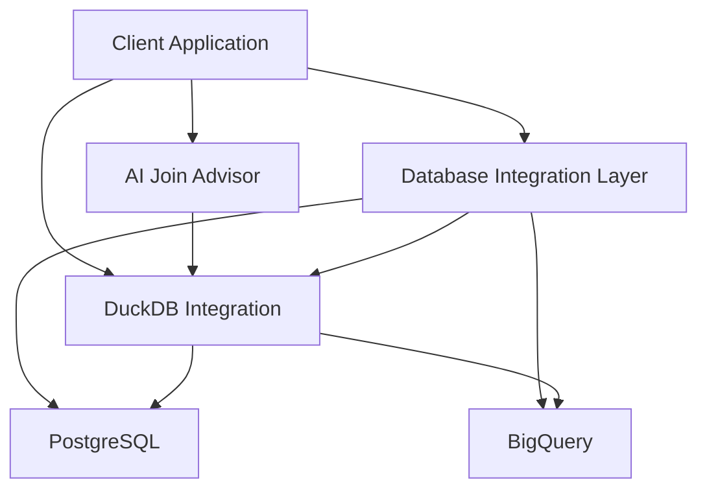

## Core Components Documentation

### 1. Database Integration Layer

#### ConnectionConfig Class
Manages database connection configurations and validation.

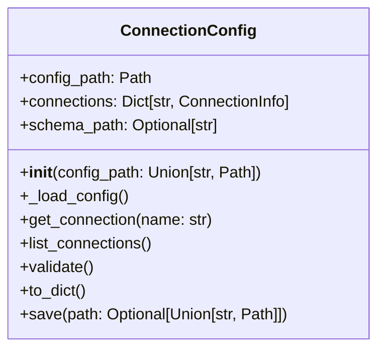

Key Methods:
- `_load_config()`: Loads and validates configuration from YAML file
- `get_connection()`: Retrieves connection information by name
- `validate()`: Validates the entire configuration
- `save()`: Saves configuration to YAML file

#### Database Class
Base class for database connections and operations.

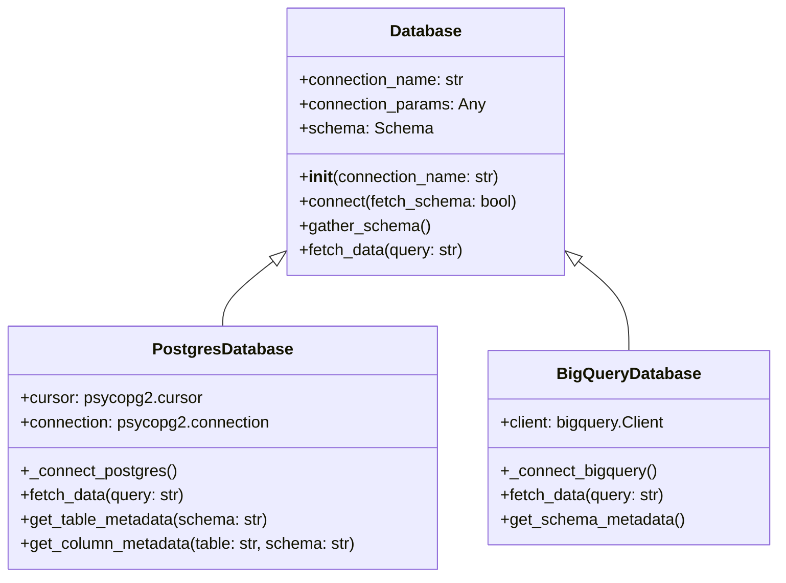

### 2. DuckDB Integration Layer

#### DuckDBIntegrator Class
Handles cross-database operations using DuckDB.

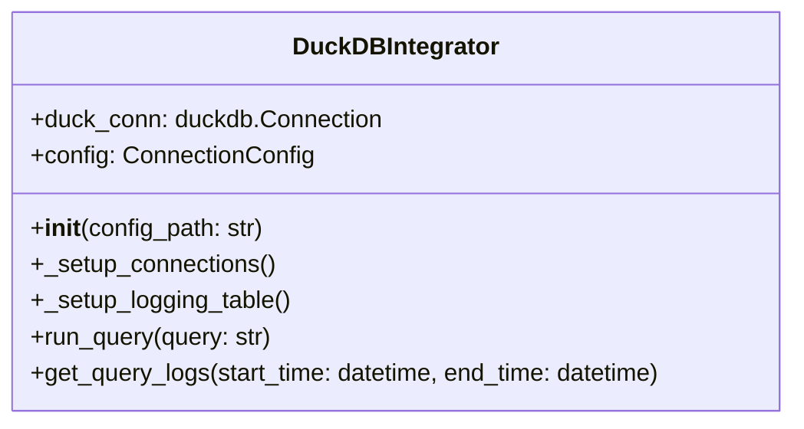

Key Methods:
- `_setup_connections()`: Initializes connections to PostgreSQL and BigQuery
- `run_query()`: Executes cross-database queries
- `get_query_logs()`: Retrieves query performance logs

### 3. AI Join Advisor

#### SmartJoinBuilder Class
Provides AI-powered join recommendations.

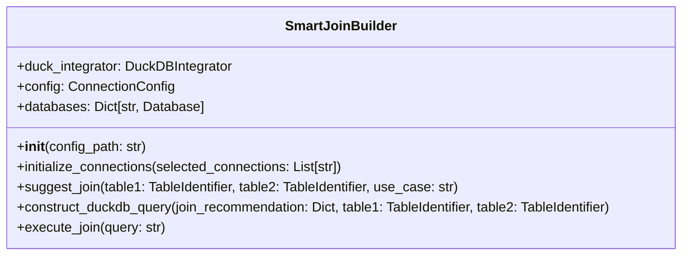

## 4. Metadata System

The metadata system manages database schema information, caching, and schema updates. It's implemented in `metadata.py` and consists of several key classes that handle database metadata representation and management.

### Class Hierarchy

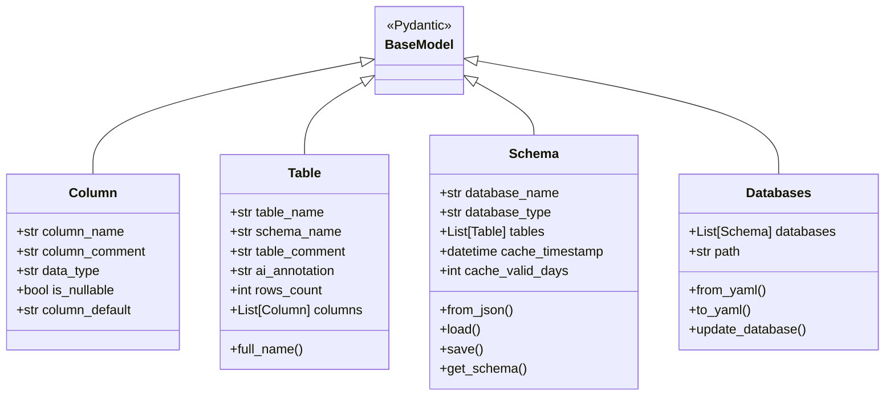

### Key Components

#### 1. Column Class
Represents a database column with its properties:
- `column_name`: Name of the column
- `column_comment`: Documentation/description of the column
- `data_type`: SQL data type
- `is_nullable`: Whether the column can contain NULL values
- `column_default`: Default value for the column

#### 2. Table Class
Represents a database table:
- `table_name`: Name of the table
- `schema_name`: Database schema name (defaults to "public" for PostgreSQL)
- `table_comment`: Documentation/description of the table
- `ai_annotation`: AI-generated annotations about the table
- `rows_count`: Number of rows in the table
- `columns`: List of Column objects

Key Methods:
- `from_json()`: Creates Schema object from JSON data
- `load()`: Loads schema from cache file with timestamp validation
- `save()`: Saves schema to cache file with updated timestamp
- `get_schema()`: Gets schema from cache or fetches fresh data

#### 4. Databases Class
Manages multiple database schemas:
- `databases`: List of Schema objects
- `path`: Default path for YAML storage
- `from_yaml()`: Creates Databases object from YAML file
- `to_yaml()`: Saves databases information to YAML file
- `update_database()`: Updates existing database schema or adds new one

### Caching System

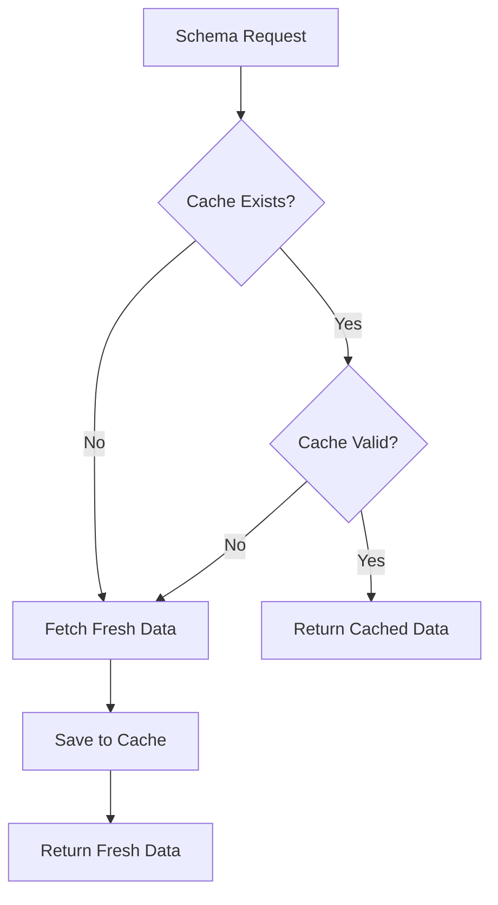

Features:
- Timestamp-based cache validation
- Configurable cache validity period
- Automatic cache refresh on expiration
- Force refresh option

### Schema Update Process

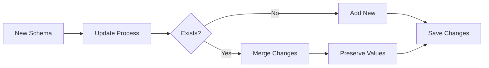

The update process:
1. Recursively compares existing and new schemas
2. Preserves existing values if new values are empty
3. Updates only non-empty values
4. Handles nested structures and lists
5. Maintains data integrity during updates

## Data Flow Diagrams

### 1. Join Recommendation Flow

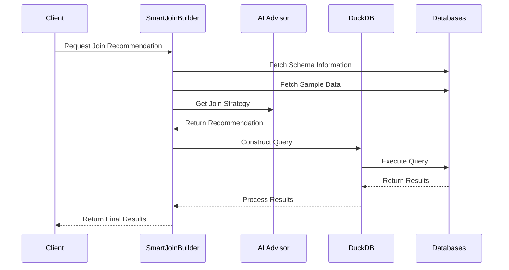

### 2. Query Execution Flow

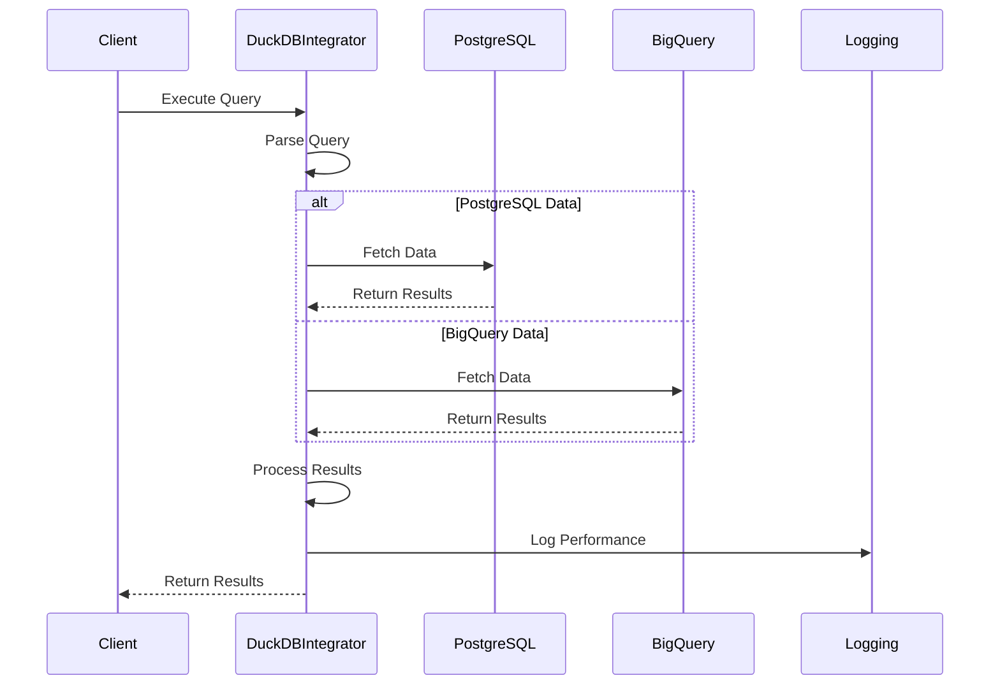

#### 3. Metadata Schema Caching
Manages database schema with caching capabilities:

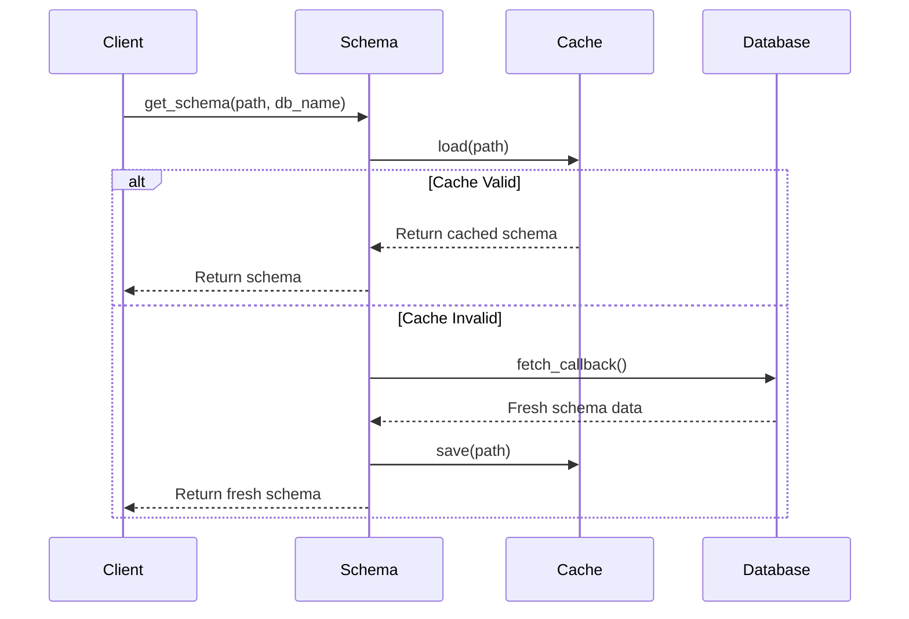

